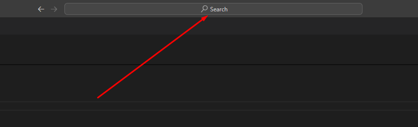
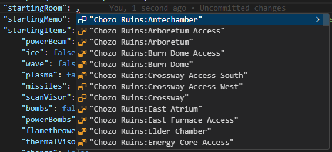
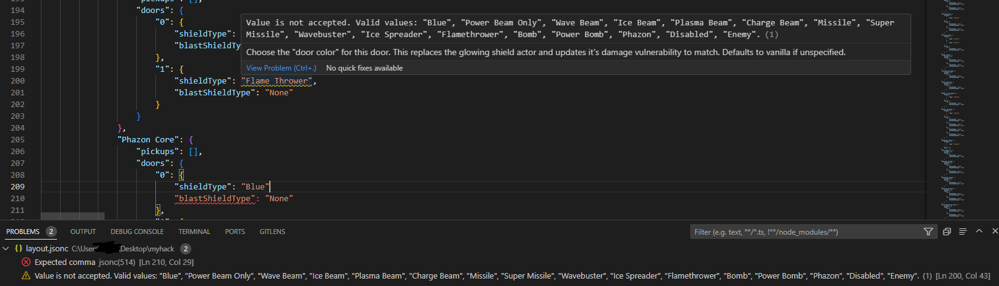

# Creator's Guide

This guide will show you how I (toasterparty) make fanhacks. It's not the end-all definitive way by any means - but it works well enough for me.

# [🎞️ Video Guide 🎥](https://www.youtube.com/watch?v=vaLeWRAe9gs)

# Requirements

- Windows 10+

- [Visual Studio Code](https://code.visualstudio.com/)

- Basic [JSON literacy](https://www.digitalocean.com/community/tutorials/an-introduction-to-json)

# Initial Setup

1. Create a new folder for storing project files. For this example, we'll use `myhack/`

1. Download and extract `randomprime_patcher.exe` from the latest [py-randomprime release](https://github.com/randovania/py-randomprime/releases) and move it to `myhack/`

1. Download [patch.bat](../tools/patch.bat), [patch_quickplay.bat](../tools/patch_quickplay.bat) and [template.jsonc](../tools/template.jsonc) from the [tools](../tools/) directory and move them to `myhack/`

1. Rename `template.jsonc` to `layout.jsonc`

You now have everything you need to develop a new romhack.

# Making Changes

First, open `layout.jsonc` with Visual Studio code.

You'll need to familiarize yourself with the API format used by the randomprime patcher. You can do this visiting the [Randomprime API](https://randovania.org/randomprime/) documentation site. You can also take advantage of Visual Studio's enriched text viewer which utilizes randomprime's JSON schema. Simply mouse over any property in the `layout.jsonc` file and a tooltip will appear describing the purpose of that value. You can also use the `CTRL`+`Space` keyboard shortcut to browse available properties and their values.

The template file we downloaded during setup starts you with a world full of missile expansions, blue doors, no blast shields, vanilla elevators, and is configured with "normal" settings. It's up to you to edit the text in this file to place pickups, set doors, change configuration and more.

# Testing Changes

Double click `patch.bat` and select your input ISO. If patching succeeds, you'll see a newly created ISO whose name was defined by the `outputIso` property of your layout file. If patching failed, you will see an error message. Check this error message thoroughly as it may contains the line number of your `layout.jsonc` file where a mistake was made.

For your convenience, `patch_quickplay.bat` has been provided which patches the same files, but it skips the main menu entirely and starts you directly in the starting room with a full inventory.

# Tips

- Make backups. It's easy to make a big mistake when you're working in one file for weeks on end.

- The JSON format used by randomprime supports comments `//`. Use them to make notes for yourself

- You can click this bar in Visual Studio Code and type `>Format Document` from time to time to fix any akwardness in spacing or line endings

- If you don't know how to format a string value, try using `CTRL`+`Space` to bring up a list of options:

- Frequently check the **Problems** tab in Visual Studio Code. Since the editor is enriched with the API format, it can inform you about mistakes:

# Resources

- [Randomprime API](https://randovania.org/randomprime/) Documentation

- [Annotated Game Maps w/ Dock Indicies](https://github.com/randovania/randomprime/blob/randovania/doc/door_indicies/readme.md)

- For the more advanced patcher features, [Prime World Editor](https://github.com/AxioDL/PrimeWorldEditor/releases) is requried to identify game objects. It also is the easiest way to visualize X/Y/Z coordinates for your object placement needs.

- [Legacy Prime Practice Mod](https://practice.metroidprime.run/) is a valid input ISO and can be used to accelerate testing your romhack

- [Dolphin Memory Engine](https://cdn.discordapp.com/attachments/897514087829897256/926669512315662436/DolphinMemEngine.7z) can be used to view/edit edit your inventory and player state in realtime. Helpful for that "final playtest" where you need to adjust one tiny mistake.

- [List of all layer changes](https://cdn.discordapp.com/attachments/897514087829897256/952809995651649576/layer_changers.txt)

- [List of all all room connections](https://cdn.discordapp.com/attachments/897514087829897256/954442920444981298/dock_connections.txt)

- [Modding Wiki](https://wiki.axiodl.com/w/index.php)

- [Primewatch](https://github.com/MetroidPrimeModding/primewatch2/releases)

- [Metroid Fool](https://github.com/toasterparty/metroid-fool/blob/main/layout.jsonc) is the fanhack which uses the most patcher features to-date. It makes a good reference if you're wanting real example to help you understand something. Similarly, [Prime Practice World](https://github.com/toasterparty/prime-practice-world/blob/main/prime-practice-world.json) uses a lot of features.

# Distribution

You can simply zip the contents of the folder you created in setup and send it to your friends. ***Please make sure to remove any ISOs from the folder before you do.*** If you would like have it officially released, get in touch with **toasterparty** to see about adding it to this repository.
